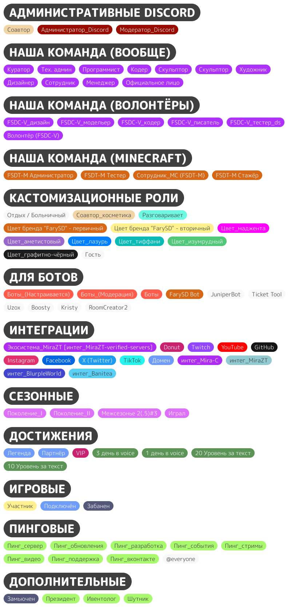

# ЧаВо

## Как начать играть?

Начинай читать [статью](../../players/start/sozdanie-tiketa.md) с примерами заявок, после чего продолжай просматривать категорию "Старт приключения".

## FarySD проект или сервер?

В зависимоти от контекста. Мы можем иметь ввиду и проект, и сервер. Чтобы упростить восприятие: есть FarySD проект, который всключает в себя Minecraft-сервера: FarySD, <засекречено>, ~~KServer~~; а также другие вещи, связанные с FarySD.

## Какой IP?

```txt
FarySD.aternos.me:35449
```

## На какие категории делятся роли в нашем Discord?

<details>

<summary>Роли и их категории</summary>

<figure><figcaption>Роли и их категории</figcaption></figure>

</details>
