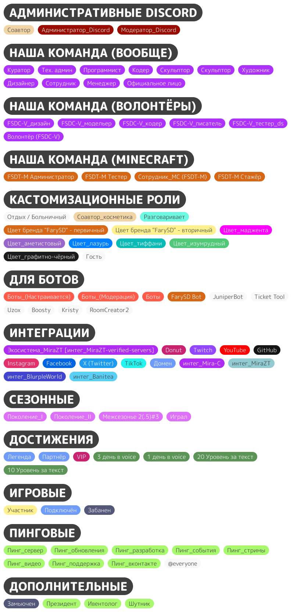

# Роли

О том, как правильно читать статусы наших пользователей.


**Осторожно!** Эту статью, возможно, следует обновить до актуальных данных!

~ aculaOne от 02.04.2024.



**Осторожно!** Статья недописана!

~ aculaOne от 24.04.2024.


## Именование ролей

### Общее

Используется сразу два формата:

1. `Категория (её сокращение) | Название роли` - для всех ролей;
2. `Префикс_название-роли` - для частоупоминающихся ролей (сделано для удобства).

| Категория     | Сокращение       | Префикс          | Предназначение                                                |
| ------------- | ---------------- | ---------------- | ------------------------------------------------------------- |
| Пинг          | ❌               | Пинг             | Роли для упоминания                                           |
| Достижения    | Награда          | ❌               | Роли для достижений                                           |
| Архив         | ❌               | Архив            | Роли без поддержки. Возможно, будут удалены                   |
| Интеграции    | ❌               | Интег            | Роли-интеграции                                               |
| Сезонные роли | Сезон            | ❌               | Роли для игроков тех или иных сезонов                         |
| Статус        | Статус           | ❌               | Роли со специальным статусом                                  |
| Титул         | Титул            | ❌               | Роли с названием титула, что выдаётся только администраторами |
| Цветовые      | Цвет             | ❌               | Роли для кастомизации                                         |
| Должность     | FSD[...ALPHABET] | FSD[...ALPHABET] | Роль для должностей                                           |

Ниже ты найдёшь более подробную информацию о каждой категории.

    
Роли и их категории

    <figure>
        
        <figcaption>Роли и их категории</figcaption>
    </figure>

### Пинг-роль

Упоминательные роли созданы для людей, кто интересуется чем-либо на сервере и хочет получать об этом оповещения.

### Роль-награда

Роли-достижения (или же награды) созданы, чтобы отобразить участников с "почётом" отдельно от остальных. Например, тех, кто получил 10 уровень за текстовую активность.

### Роль-архив

Архивные роли – роли, созданные ранее, но вышедшие из эксплуатации. Администраторы либо придумают им новое применение, либо удалят, либо оставят в качестве исторического наследия... Они, как правило, не снимаются, но их права обнуляются.

### Роль-интеграция

Роли для связки, то есть интеграции, создана для того, чтобы отобразить ту или иную связку. Например, роли `GitHub`, `Twitch` и тем подобные...


**Осторожно!** Ручные роли-интеграции были перемещены в архив (`MiraZT`, `BlurpleWorld` и тд).



**Осторожно!** Некоторые роли-интеграции были перемещены в архив из-за ненадобности или прекращения их поддержки не с нашей стороны (`Instagram`, `TikTok` и тд).


### Сезонная роль

Они были созданы для того, чтобы отделять людей по серверным сезонам, таким как: первый, второй и их межсезонья. Если у человека есть данные роли, то, скорее всего, он активно играл в это время на сервере.

### Роль-статус

Созданы для отображения статуса. Схожи по значению с ролями для достижений, но более элитны.

### Роль-титул

Созданы, чтобы соединить часть ролей, что не входят в другие категории.

### Цветовая роль

Созданы для кастомизации профиля.

### Роль-должность

Должностные роли созданы для отделения обычных людей от работающих над сервером.

Логика построения названия роли:

1. Приставка FSD, как правило: `FSD`;
2. Если есть префикс FSD, то добавляется буква, обозначающая главную группу: `FSDT`, `FSDC`;
3. Если есть префикс FSD, то добавляется буква(-ы) с нижним подчеркиванием после главной группы, обозначающая(-ие) подгруппу: `FSDT_M`, `FSDC_V`;
4. Если подгруппа учитывает дочерние группы, то добавляется буква(-ы), обозначающая(-ие) сферу деятельности с префиксом "-": ~~`FSDT_M`~~, `FSDС_V-D`;
5. В имени роли полное название должности или же в формате: `FSDT_M | Технический администратор`, `FSDC_V-D | Модератор`.

Сокращённый вариант выглядит следующим образом (чаще всего используется в письме): `FSDT_M (ТА)`, `FSDC_V-D (М)`.

Группы:

| Название   | Альт. название | Аббревиатура | Дочерние группы              |
| ---------- | -------------- | ------------ | ---------------------------- |
| Команда    | Team           | T            | Таблица "Сферы деятельности" |
| Сообщество | Community      | C            | Volunteers (V), Players (P)  |

Сферы деятельности:

| Название  | Аббревиатура |
| --------- | ------------ |
| Minecraft | M            |
| Discord   | D            |
| VKontakte | VK           |
| Telegram  | TG           |
| Site      | S            |

Должности:

| Название                                | Аббревиатура (кириллица) |
| --------------------------------------- | ------------------------ |
| Администратор высшего разряда (Соавтор) | АВР                      |
| Администратор                           | А                        |
| Технический администратор               | ТА                       |
| Модератор                               | М                        |
| Хелпер                                  | Х                        |
| Менеджер                                | Ме                       |
| Куратор                                 | Ку                       |
| Программист                             | Пр                       |
| Кодер                                   | К                        |
| Тестер                                  | Т                        |
| Дизайнер                                | Д                        |
| Художник                                | Ху                       |
| Модельер (Скульптор)                    | Мо                       |
| Писатель                                | П                        |
