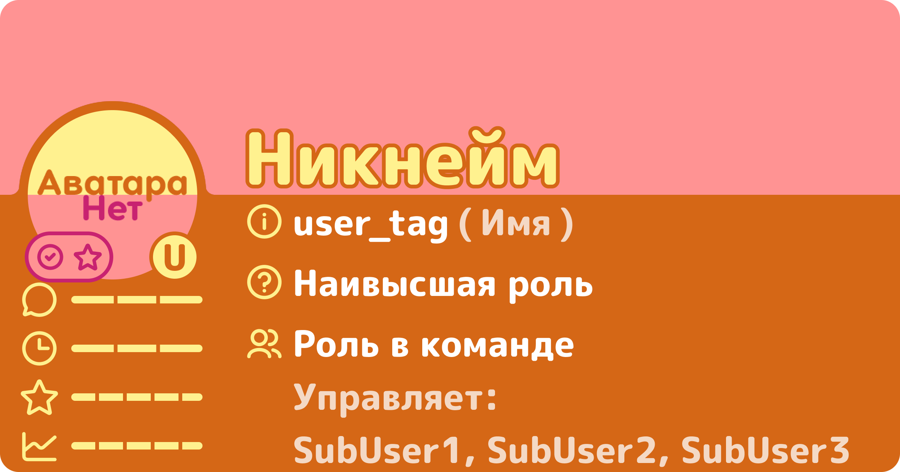
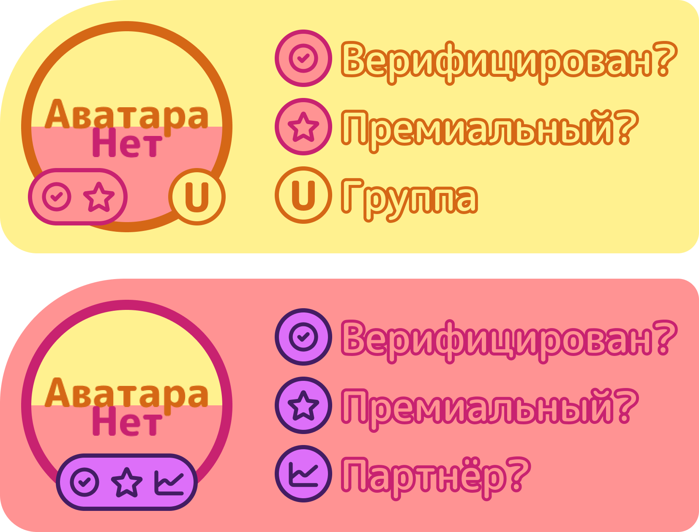

# Карта пользователя


**Осторожно!** Карты пользователей теперь выдаются только людям, внёсшим большой вклад.


## Тип: Обычная

### Основные поля

<figure><figcaption>Шаблон карты</figcaption></figure>

Содержит:

1. Никнейм - Рабочий никнейм (НЕ игровой);
2. user_tag - Discord-тег пользователя:
   - Имя - Реальное имя человека;
3. Наивысшая роль - статус пользователя в области проекта FarySD (пример: создатель);
4. Роль в команде - роль, полученная только внутри группы, от которой он наследует права (примеры: управляющий, главный переводчик, дизайнер);
5. Управляет: ...списокЛюдей - кем этот пользователь управляет в своей группе (это поле доступно только управляющим).

### Бейджи

- Галочка - проверенный / верифицированный пользователь;
- Звёздочка - премиальный ли;
- Символ (буква в право-нижнем углу) - группа (в какой группе человек).

<figure><figcaption>Бейджи</figcaption></figure>

### Колбы


Имеются ввиду полоски / линии под аватаркой 😜


Шаблон карты

<figure><figcaption>Шаблон карты</figcaption></figure>


Написаны сверху вниз, оринтируясь по шаблону карты (смотри выше). В скобках количество секций.


1. Дружелюбность (макс. 3);
2. Время ответа (макс. 3);
3. Рейтинг пользователя (макс. 5);
4. Активность (макс. 5).

Чем выше балл, тем лучше.
Пример трёх-секционной колбы: 1/3 - плохо, 2/3 - средне, 3/3 - отлично.

## Тип: Благодарственная
