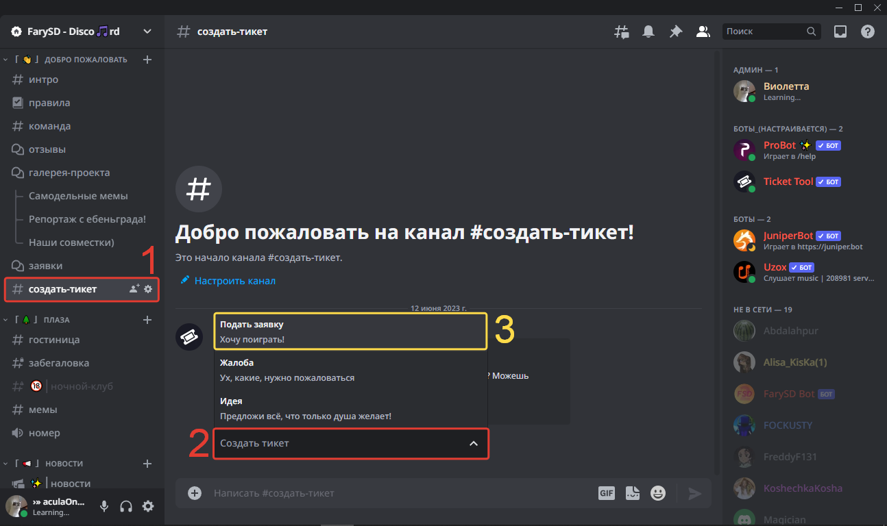
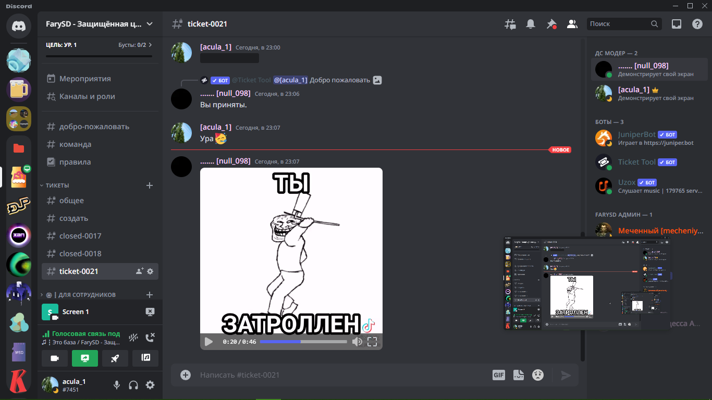

# 📙 Создание тикета

## Зачем этот раздел?

Здесь ты научишься правильно создавать тикет) А что ты тут ожидал?


Перед началом перейди [в наш дискорд](https://discord.gg/invite/ZxwXC6ETpu)


## Вводные слова

На сервере есть два способа подачи заявки:

1. Создать статью в форуме с именем `#заявки`
2. Создать тикет (Старый способ)

## Первый способ

### Правила

Как и на любом другом проекте у нас есть определённые правила. Для подачи заявок тем более. Прочитать ты их сможешь, если раскроешь их. Там всё написано.\

<figure><figcaption></figcaption></figure>

### Итог

В итоге ты должен написать о себе в виде небольшого рассказа, или как ответом на форму. Пример второго ниже:

<figure><figcaption></figcaption></figure>

## Второй способ

### Самое главное

Перед тем как подавать тикет, ты должен прочитать  правила!\
&#x20;

<figure><figcaption></figcaption></figure>


В правилах есть ещё ссылки на правила для майнкрафт сервера, прочитай их!


Прочитал всё? Тогда переходи дальше

### Оформление тикета

Эй, куда!? Сначала нужно найти куда нажимать!

1. Первым-наперво переходим в канал `создать-тикет` в категории `Добро-пожаловать`
2. Потом нажми на "Создать тикет".
3. &#x20;И... Выбери в раскрывающемся списке "Подать заявку"!

<figure><figcaption></figcaption></figure>

Потом для вас открывается большая форма, но не переживайте, сейчас объясню

1. В поле `Никнейм` ваш игровой (майнкрафт) никнейм.
2. В поле `Биография` вы пишите о себе. Запомни, это поле будут проверять, исключительно, серьёзнее остальных. Пиши адекватно!
3. Напиши свой реальный возраст.
4. Твоё реальное имя и кто тебя пригласил. Логично.
5. В поле `РП-Биография` пиши описание своего _РП-героя_! Это поле является необязательным.
6. Нажимаешь "Сохранить" и ждёшь проверки твоей формы модерацией сервера.


Поле со **`*`** - **обязательно**


<figure><figcaption></figcaption></figure>


Некорректная заявка может получить статус <mark style="color:red;">Отказано</mark>!


### Принятие ~~себя~~ тикета

После нескольких лет тренировки ты сможешь создать идеальный тикет, а пока жди оперативной работы админов)

<figure><figcaption></figcaption></figure>

Упс...

<figure><figcaption></figcaption></figure>

Но ты сделал всё правильно, поэтому жди!

В качестве бонуса (видео со скриншота):




Поздравляю! Ты смог осилить первую ступень знакомства.

