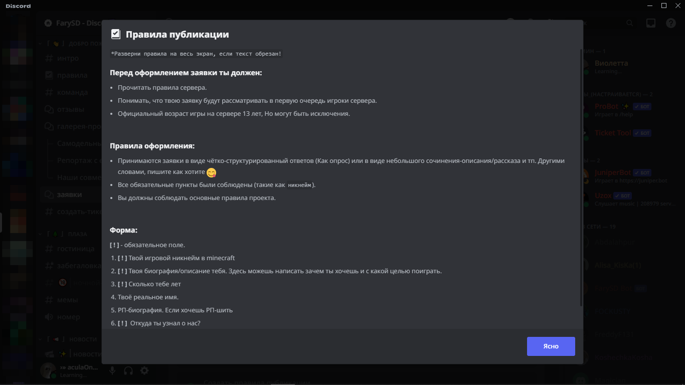
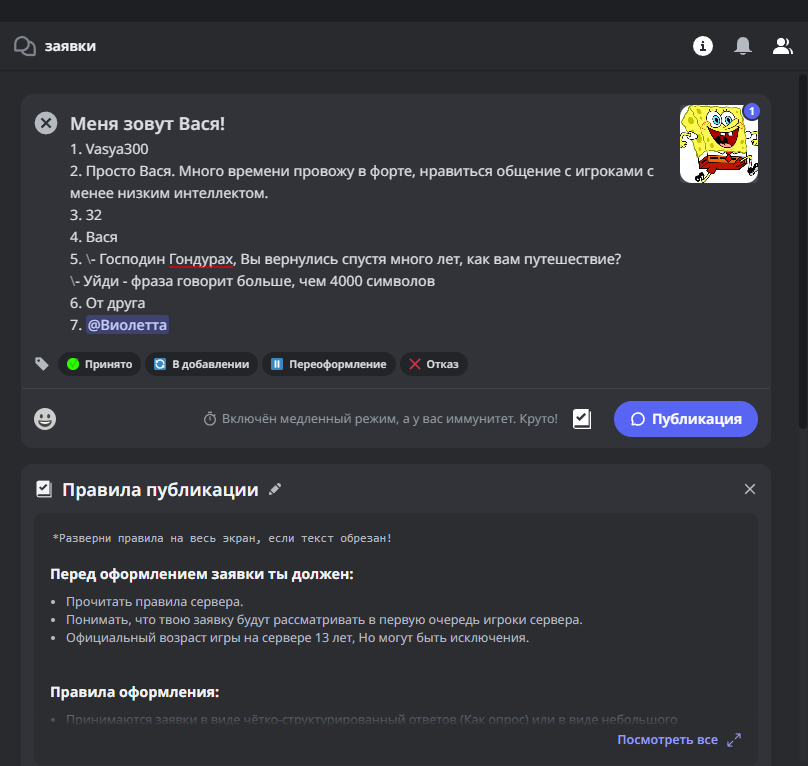
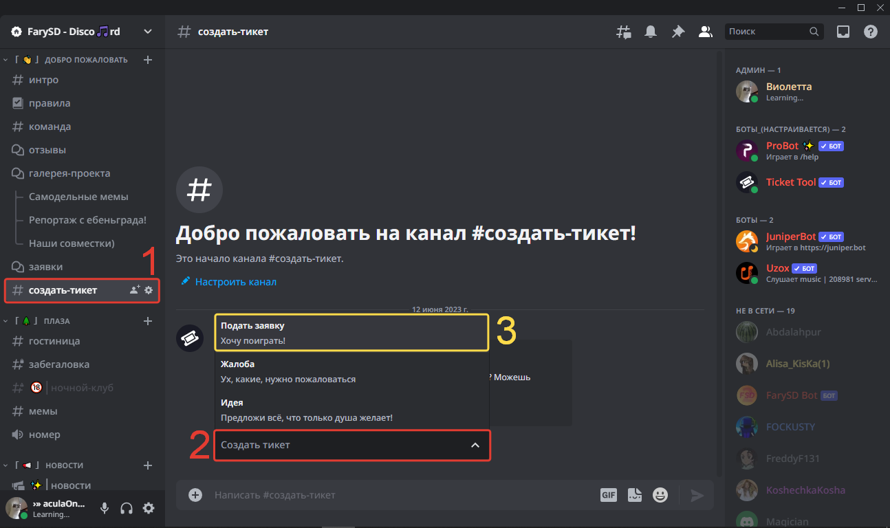
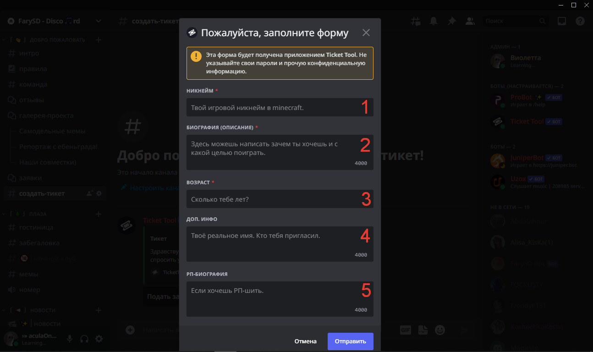
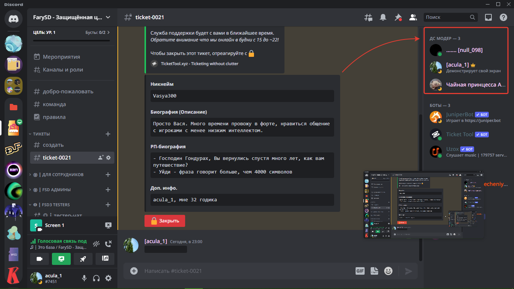
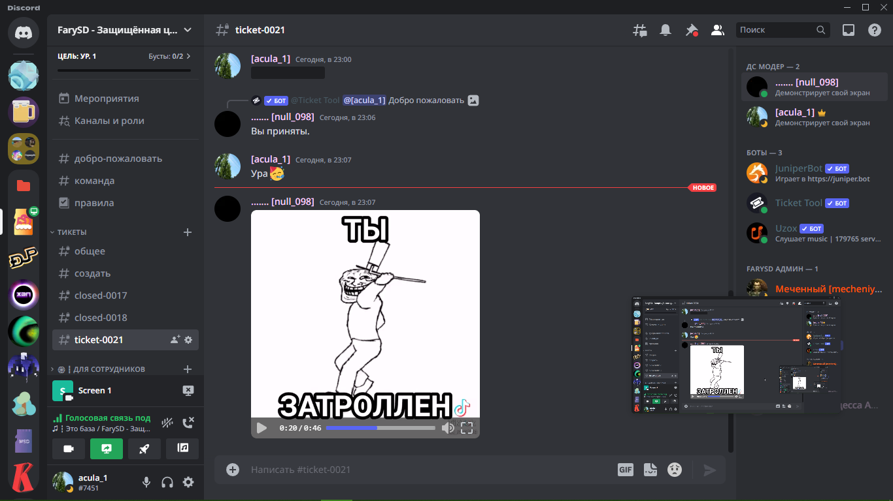

# 📙 Создание тикета

## Зачем этот раздел?

Это полное и понятное руководство по написанию заявки с причиной "играть на сервере".


Перед началом, стоит [перейти](https://discord.gg/invite/ngxE7dUzbE) в наш Discord-сервер.


## Вводные слова

На сервере есть два способа подачи заявок:

1. Создать статью в форуме `#заявки`
2. Создать тикет ( Устаревший способ )

Рекомендуется использовать первый способ, так как он сильно приветсвуется среди администраторов, а про второй стоит уже позабыть, ведь скоро он выйдет из эксплуатации.

## Первый способ

### Правила

Чтобы играть на нашем проекте, следует знать его правила. Ты сможешь прочесть информацию о правилах в канале [#интро](https://discord.com/channels/868794603409637376/1068985628181680300) ("Начало начал"). После прочтения правил проекта, ты сможешь перейти к непосильной задаче - составить тикет; но почему же она непосильная? А непосильная по той причине, что тебе снова нужно прочитать правила, но уже форумные! Для каждого форума они свои, и чтобы прочитать их, нужно раскрыть правила публикации (кнопка в виде книги).

<figure><figcaption>Правила публикации в расскрытом виде</figcaption></figure>

### Результат

В результате должно получиться что-то по типу "о себе" в виде небольшого рассказа, или как ответ на анкетирование. Пример второго ниже:

<figure><figcaption>Заявка в стиле "Анкета"</figcaption></figure>

### Советы

1. Пытайтесь вместить в заголовок свой игровой никнейм (Minecraft-никнейм) или имя.
2. Заголовк должен быть максимально кратким по содержанию, но органично вписываться с самой заявкой.
3. Заголовк должен иметь смысл.
4. Сама форма должна быть максимально внятной, чёткой, структурированной, грамотной и обширной в плане информации. Так ваши шансы на успех повысятся... Даже, если это не так, то администраторы скажут Вам спасибо.

## Второй способ


Всё написанное ниже не будет как-либо редактироваться и дополняться. Информация может быть неактуальной!


### Самое главное

Перед тем как подавать тикет, ты должен прочитать правила!

<figure><figcaption></figcaption></figure>


В правилах есть ещё ссылки на правила для майнкрафт сервера, прочитай их!


Прочитал всё? Тогда переходи дальше

### Оформление тикета

Эй, куда!? Сначала нужно найти куда нажимать!

1. Первым-наперво переходим в канал `создать-тикет` в категории `Добро-пожаловать`
2. Потом нажми на "Создать тикет".
3. И... Выбери в раскрывающемся списке "Подать заявку"!

<figure><figcaption></figcaption></figure>

Потом для вас открывается большая форма, но не переживайте, сейчас объясню

1. В поле `Никнейм` ваш игровой (майнкрафт) никнейм.
2. В поле `Биография` вы пишите о себе. Запомни, это поле будут проверять, исключительно, серьёзнее остальных. Пиши адекватно!
3. Напиши свой реальный возраст.
4. Твоё реальное имя и кто тебя пригласил. Логично.
5. В поле `РП-Биография` пиши описание своего _РП-героя_! Это поле является необязательным.
6. Нажимаешь "Сохранить" и ждёшь проверки твоей формы модерацией сервера.


Поле со **`*`** - **обязательно**


<figure><figcaption></figcaption></figure>


Некорректная заявка может получить статус <mark style="color:red;">Отказано</mark>!


### Принятие ~~себя~~ тикета

После нескольких лет тренировки ты сможешь создать идеальный тикет, а пока жди оперативной работы админов)

<figure><figcaption></figcaption></figure>

Упс...

<figure><figcaption></figcaption></figure>

Но ты сделал всё правильно, поэтому жди!

В качестве бонуса (видео со скриншота):




Поздравляю! Ты смог осилить первую ступень знакомства.

