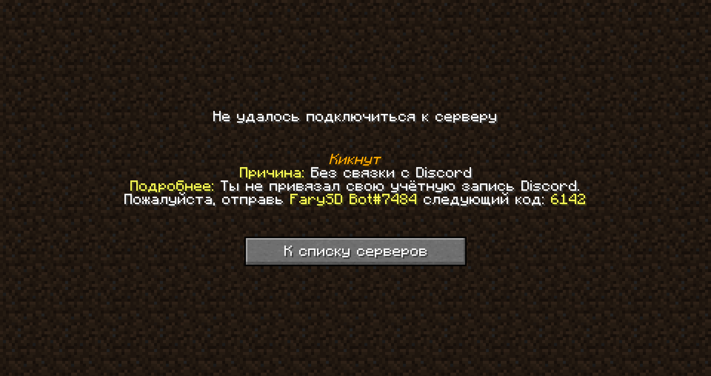

# Привязка своего Discord аккаунта

## Перед читанием

1. В заголовке не опечатка;
2. Этот этап выполняется после [создания тикета](./sozdanie-tiketa.md).


Перед началом, убедись в том, что ты [в нашем](https://discord.gg/invite/ngxE7dUzbE) Discord-сервере.


## Связка аккаунтов


**Стой!** Ни за что не отдавай код для привязки до самого связывания, а иначе человек получивший код сможет привязать твой Minecraft-аккаунт к своему Discord.


Чтобы связать Discord и Minecraft (далее: MC) аккаунты, нужно выполнить несколько простых шагов:

1. Попробовать зайти на MC сервер ([ЧаВо](../../additional/start/faq.md#какой-ip));
2. Открыть в Discord личную переписку с `FarySD Bot#7484`;
3. Отправить ему код, увиденный на экране при попытке подключиться к MC-серверу. Например, на скриншоте ниже это: "_6142_";
4. При удачной связке ты увидешь сообщение: "_Ваш Discord аккаунт был успешно привязан к Minecraft-аккаунту <player_name> (<player_uuid>)_". Радуйся (или делай всё вновь)!

<figure><figcaption>Экран связывания</figcaption></figure>
