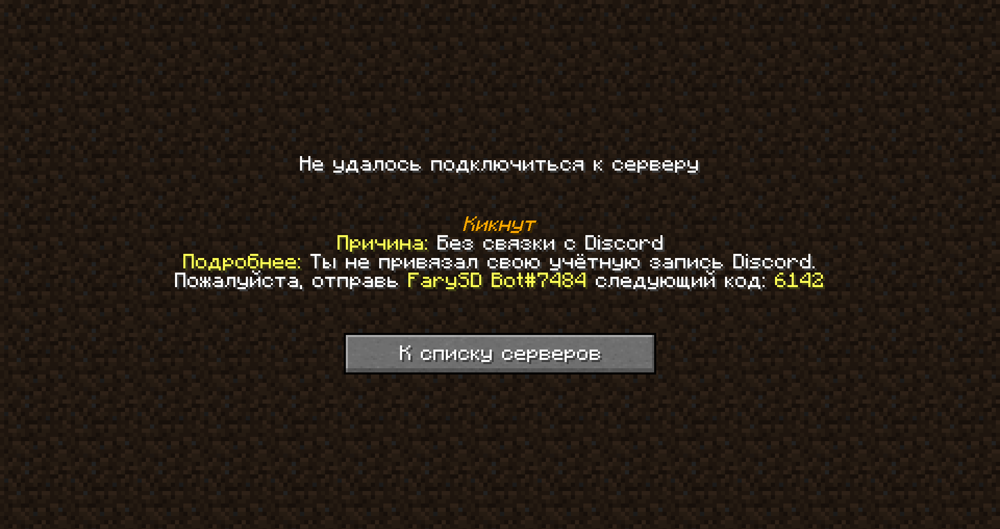

# Привязка своего Discord аккаунта

## Перед читанием

Этот этап выолняется перед (_плашка снизу_)...


[sozdanie-tiketa.md](./sozdanie-tiketa.md)



Перед началом, убедись в том, что ты [на нашем](https://discord.gg/invite/ngxE7dUzbE) Discord-сервере.


## Связка аккаунтов


**Стой!** Ни за что не отдавай код для привязки до самого связывания, а иначе человек получивший код сможет привязать твой MC аккаунт к своему Discord.


Чтобы связать Discord и Minecraft (далее: MC) аккаунты, нужно выполнить несколько простых шагов:

1. Попробовать зайти на MC сервер ~~(ЧаВо)~~;
2. Открыть в Discord личную переписку с `FarySD Bot#7484`;
3. Отправить в личные собщения код, увиденный на экране при попытке входа в MC сервер. Например, на скриншоте ниже это: "_6142_";
4. При удачной связке ты увидешь сообщение: "_Ваш Discord аккаунт был успешно привязан к Minecraft-аккаунту <player_name> (<player_uuid>)_".

<figure><figcaption>Экран связывания</figcaption></figure>
